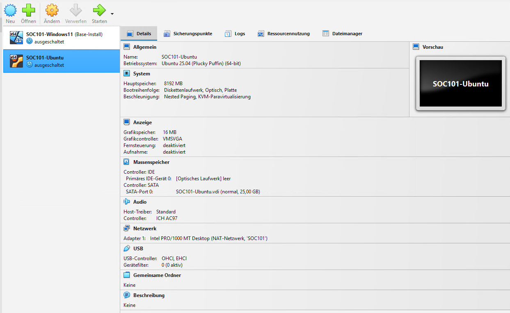
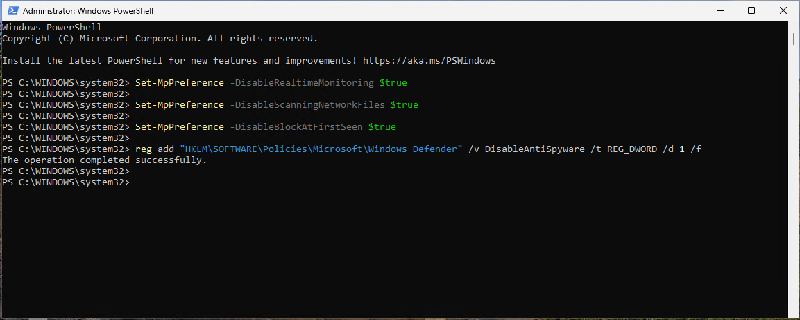
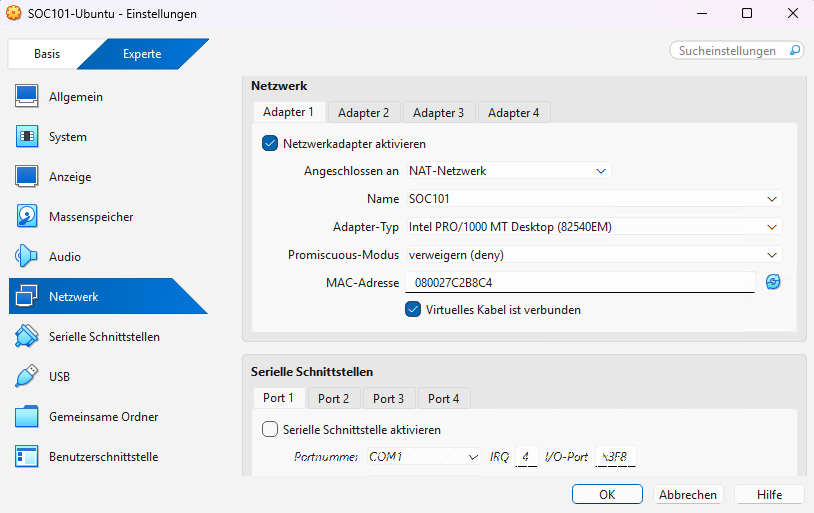
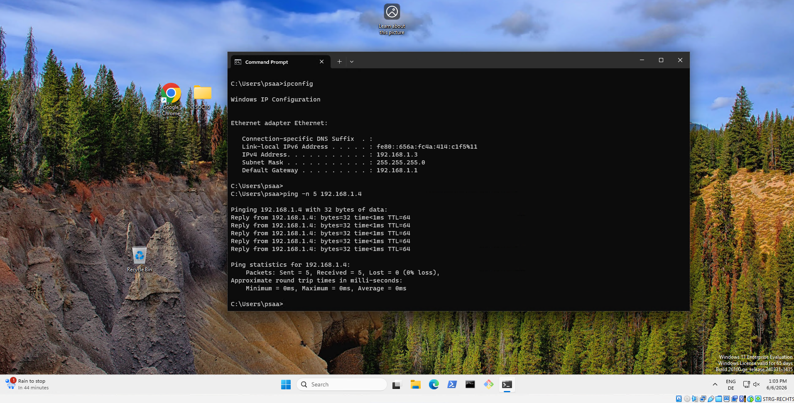
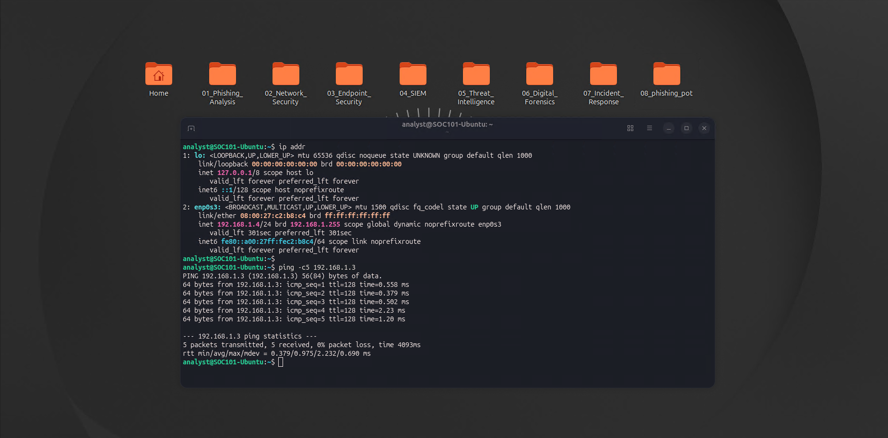

# SOC Analyst Lab

A hands-on SOC analyst lab covering malware analysis, phishing investigation, network security, endpoint security, SIEM, threat intelligence, digital forensics, and incident response.

## Lab Setup

### Installing Oracle VM VirtualBox

- [VirtualBox Downloads](https://www.virtualbox.org/wiki/Downloads)
- [Install VirtualBox on Mac](https://cs.hofstra.edu/docs/pages/guides/vbox_mac.html)
- [Install VirtualBox on Linux](https://phoenixnap.com/kb/install-virtualbox-on-ubuntu)
- [Visual C++ Redistributable](https://learn.microsoft.com/en-us/cpp/windows/latest-supported-vc-redist?view=msvc-170)



### Installing Windows

- [Windows 11 Enterprise Evaluation](https://www.microsoft.com/en-us/evalcenter/download-windows-11-enterprise)
- [Git](https://git-scm.com/)


### Configuring Windows

```powershell
Set-MpPreference -DisableRealtimeMonitoring $true
Set-MpPreference -DisableScanningNetworkFiles $true
Set-MpPreference -DisableBlockAtFirstSeen $true
reg add "HKLM\SOFTWARE\Policies\Microsoft\Windows Defender" /v DisableAntiSpyware /t REG_DWORD /d 1 /f
```



### Installing Ubuntu

- [Ubuntu Desktop](https://ubuntu.com/download/desktop)
- [Past Ubuntu Releases](https://releases.ubuntu.com/)

```bash
sudo apt update
sudo apt install linux-headers-generic
sudo apt install linux-headers-$(uname -r)
sudo apt install bzip2 tar gcc make perl git
```


### Configuring Ubuntu

```bash
sudo apt update
sudo apt install net-tools hping3
```

### Configuring the Lab Network

A dedicated NAT Network (`SOC101`) was created in VirtualBox to allow isolated communication between the Windows and Ubuntu VMs. This ensures that potentially malicious files cannot reach the external network, which is critical for safe malware analysis.




